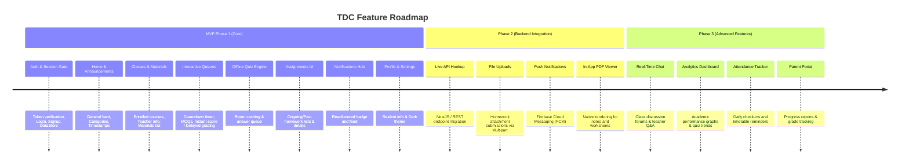

# TDC Android — MVP Specification & Feature Roadmap

> **Target Version:** MVP v1.0  
> **Platform:** Android (Kotlin, Jetpack Compose, Material 3, MVVM, Room, Hilt)  
> **Target API Level:** Min SDK 28 (Android 9.0) | Target SDK 35 (Android 15)  
> **Status:** Active / Ready for Backend Integration  

---

## 1. Executive Summary

**TDC (The Digital Classroom)** is a high-performance, modern Android application engineered for students to seamlessly manage their academic lifecycle. The app aggregates announcements, enrolled classes, course materials, interactive quizzes, assignments, and real-time notifications into an intuitive, elegant interface with offline-first capabilities.

This document outlines the complete feature set, functional requirements, technical architecture, and the definitive **Minimum Viable Product (MVP)** scope versus post-MVP roadmap.

---

## 2. Core Feature Matrix

| Feature Module | Component / Screen | MVP Status | Priority | Description |
|---|---|---|---|---|
| **Authentication** | Splash Screen | ✅ Implemented | P0 | Automatic token check and routing gate |
| **Authentication** | Login Screen | ✅ Implemented | P0 | Email/Password login, input validation, password toggle |
| **Authentication** | Sign-Up Screen | ✅ Implemented | P0 | Student registration (Name, Email, Password, Class, Section) |
| **Authentication** | Session & JWT | ✅ Implemented | P0 | Persistent DataStore token management with Retrofit Interceptor |
| **Main Navigation** | Bottom Navigation Bar | ✅ Implemented | P0 | 3 primary tabs: Profile, Home, Assignments |
| **Main Navigation** | Top App Header | ✅ Implemented | P0 | TDC Logo, centered title, unread notification badge |
| **Home — General** | Announcements Feed | ✅ Implemented | P0 | Categorized school/class announcements with author info |
| **Home — Classes** | Enrolled Classes List | ✅ Implemented | P0 | Course cards showing teacher, room, and weekly schedule |
| **Home — Classes** | Class Details & Materials | ✅ Implemented | P0 | Deep-dive screen with downloadable course materials & notes |
| **Home — Quiz** | Quiz Dashboard | ✅ Implemented | P0 | Categorized lists: Available, Upcoming, and Past Quizzes |
| **Home — Quiz** | Quiz Taking Engine | ✅ Implemented | P0 | Timed assessment, single/multi-MCQs, progress bar, auto-submit |
| **Home — Quiz** | Quiz Results & Scoring | ✅ Implemented | P0 | Pending grading state & detailed score/answer breakdown |
| **Home — Quiz** | Offline Quiz Caching | ✅ Implemented | P0 | Room caching of questions and offline submission queue |
| **Assignments** | Ongoing & Past Tabs | ✅ Implemented | P0 | Tabbed view of homework and assignments with due dates |
| **Assignments** | Assignment Details | ✅ Implemented | P0 | Full task description, due date tracking, attachments list |
| **Assignments** | Homework Submission | 🟡 UI Staged | P1 | File attachment picker & student homework upload |
| **Notifications** | Notification Feed | ✅ Implemented | P0 | Chronological alerts (quizzes, announcements, class updates) |
| **Notifications** | Read/Unread Tracking | ✅ Implemented | P0 | Visual unread dot and tap-to-mark-as-read |
| **Profile** | User Profile View | ✅ Implemented | P0 | Student details, avatar initials, grade, section, contact info |
| **Profile** | Theme & Settings | ✅ Implemented | P1 | Dark/Light theme toggle & persistent DataStore settings |
| **Profile** | Secure Logout | ✅ Implemented | P0 | Token clearance and navigation backstack reset |

---

## 3. Comprehensive Feature Breakdown

### 🔐 3.1. Authentication & Security (Gate Pattern)
* **Auth-Gated Navigation:** Authentication operates as a prerequisite gate before entering the main shell. Unauthenticated users cannot access student data.
* **Token Verification (Splash Screen):** On application launch, `SplashScreen` verifies the existence and validity of stored tokens in DataStore. If valid, redirects directly to `MainScreen`; otherwise directs to `LoginScreen`.
* **Login & Validation:** Validates email format and password length, toggles password visibility, presents clear inline error states, and captures server error codes.
* **Sign-Up / Onboarding:** Form for students with fields: Full Name, Email, Password, Class/Grade, Section.
* **Token Interceptor:** `OkHttpClient` dynamically injects `Authorization: Bearer <token>` on all outbound network requests.
* **Session Termination:** Logout clears the token, deletes transient cache, and pops the backstack to `LoginScreen`.

---

### 🏠 3.2. Home Hub (3-Tab Pager)

#### A. General (Announcements)
* **Announcement Stream:** Real-time feed of academic and campus notices.
* **Metadata & Badges:** Displays category chips (e.g., *Exam*, *Holiday*, *Sports*, *General*), author name, author avatar, and formatted relative timestamps (e.g., "2 hours ago").
* **Rich Content Cards:** Expandable text cards styled with Material 3 elevated surfaces.

#### B. Classes & Course Materials
* **Enrolled Classes Feed:** Lists all enrolled subjects with teacher name, classroom/room ID, and weekly timetable schedule.
* **Class Detail Screen (`ClassDetailScreen`):**
  * Course syllabus and subject overview.
  * Teacher contact information and office hours.
  * **Course Materials Repository:** Categorized items (PDF notes, video lectures, practice question sets, presentation slides) with direct download/view URLs.

#### C. Quiz & Online Testing Engine
* **Tri-State Quiz Dashboard:**
  * **Available:** Quizzes currently active and ready for the student to attempt.
  * **Upcoming:** Quizzes scheduled for a future date/time with a countdown.
  * **Past / Completed:** Previous attempts and submitted assessments.
* **Interactive Full-Screen Test Engine (`QuizTakingScreen`):**
  * **Live Countdown Timer:** Header timer counting down in minutes and seconds with automatic force-submission on expiration.
  * **Dynamic Question Stepper:** Linear progression with question count index (e.g., `Question 3 of 10`) and animated progress bar.
  * **Question Types:**
    * Single-choice MCQs with radio selectors.
    * Multi-select MCQs with checkboxes.
  * **Navigation & Confirmation:** Next/Previous buttons and exit protection dialogs preventing accidental test closure.
* **Quiz Results & Evaluation (`QuizResultScreen`):**
  * **Pending State:** Supports delayed grading policies (*"Results Not Out Yet"* screen with status clock).
  * **Released State:** Comprehensive performance card featuring Total Score, Percentage, Grade Badge, and question-by-question breakdown of chosen vs. correct answers.

---

### 📝 3.3. Assignments Management
* **Status-Based Tabs:** Seamless switching between **Ongoing** (pending due dates) and **Past** (completed/expired) assignments.
* **Assignment Cards:** Highlighted subject tag, assignment title, two-line preview description, formatted due date badge, and attachment count indicator.
* **Assignment Detail Screen (`AssignmentDetailScreen`):**
  * Detailed prompt and guidelines from the instructor.
  * Due date and countdown warning.
  * List of downloadable attachments and instruction worksheets provided by the teacher.
  * Floating Action Button (FAB) to attach homework solutions and project files.

---

### 🔔 3.4. Notifications Center
* **Categorized Alerts:** Differentiates between Announcement alerts, Quiz reminders, Class schedule changes, and General notices.
* **Read / Unread State:** Visual unread indicator (teal badge dot + tinted container); tap to toggle/mark as read.
* **Instant Access:** Accessible via the top bar notification bell with red unread badge from any home tab.

---

### 👤 3.5. Student Profile & Settings
* **Profile Header:** Large avatar with fallback student initials, full name, class/grade, and section.
* **Contact Information:** Verified email and telephone number.
* **App Preferences:** Dark mode / Light mode theme preferences.
* **Session Management:** Secure sign-out with confirmation.

---

### 💾 3.6. Offline-First Architecture & Resilience
* **Room Database (`TdcDatabase`):**
  * `QuizQuestionEntity`: Local caching of quiz questions when a quiz starts, allowing the student to finish the test even during intermittent Wi-Fi/mobile network drops.
  * `PendingSubmissionEntity`: Offline sync queue that securely stores student answers locally if offline during submit, ready to re-transmit once connection is restored.
* **DataStore Preferences (`DataStoreManager`):**
  * Fast, non-blocking asynchronous storage for Auth JWT tokens, User ID, and theme configurations.

---

## 4. Technical Architecture & Tech Stack

```
                     ┌─────────────────────────────────────────┐
                     │            Jetpack Compose UI           │
                     │  (Material 3 / Dark Teal Modern Theme)   │
                     └────────────────────┬────────────────────┘
                                          │ Observes StateFlow
                                          ▼
                     ┌─────────────────────────────────────────┐
                     │          Hilt ViewModels (MVVM)         │
                     │ (Auth, General, Classes, Quiz, Profile) │
                     └────────────────────┬────────────────────┘
                                          │ Calls domain operations
                                          ▼
                     ┌─────────────────────────────────────────┐
                     │           Repository Layer              │
                     │ (Clean interface / Impl abstraction)    │
                     └──────────┬────────────────────┬─────────┘
                                │                    │
                  Fetches Remote│                    │Persists Local
                                ▼                    ▼
        ┌─────────────────────────────┐        ┌────────────────────────────┐
        │        Retrofit + OkHttp    │        │    Room Database (SQLite)  │
        │ - Auth, Profile, Classes    │        │ - Quiz & Question Cache    │
        │ - Quiz, Announcements, DTOs │        │ - Pending Submissions      │
        │ - Bearer Token Interceptor  │        │ - DataStore Preferences    │
        └─────────────────────────────┘        └────────────────────────────┘
```

| Layer | Technologies Used |
|---|---|
| **Language** | Kotlin 2.1.0 |
| **UI Framework** | Jetpack Compose + Material 3 + Extended Icons |
| **Architecture** | MVVM (Model-View-ViewModel) + Clean Layering |
| **Dependency Injection** | Dagger Hilt 2.52 with KSP |
| **Networking** | Retrofit 2.11.0 + OkHttp 4.12.0 + Logging Interceptor |
| **Serialization** | `kotlinx.serialization` (JSON DTOs) |
| **Local Database** | Room 2.6.1 (SQLite with Coroutines) |
| **Preferences** | AndroidX DataStore Preferences 1.1.1 |
| **Image Loading** | Coil 2.7.0 for Compose |
| **Navigation** | Navigation Compose 2.8.5 (Auth-Gated NavHost) |

---

## 5. MVP Scope vs. Post-MVP Roadmap



### ✅ In-Scope for MVP v1.0
1. **Auth & Identity:** Full login, registration, token persistence, and auto-login splash.
2. **Announcements:** Feed with category tagging and author metadata.
3. **Classes & Syllabus:** Class listings with schedules and downloadable material links.
4. **Complete Quiz Experience:**
   * List filtering (Available, Upcoming, Past).
   * Live timed quiz taking with progress indicators.
   * Single and multi-answer MCQ support.
   * Auto-submission on timer expiry.
   * Delayed vs. instant results screen.
   * Local Room caching for offline test resilience.
5. **Assignments Hub:** List view of active/past assignments with detail descriptions and attachment metadata.
6. **Notifications:** Feed with read/unread visual indicators.
7. **Profile:** Complete student profile display with settings and logout.
8. **UI/UX Consistency:** Material 3 Dark Teal design system with custom components (`TdcButton`, `TdcTextField`, `EmptyStateScreen`, `ErrorScreen`, `LoadingScreen`).

### 🚀 Out-of-Scope (Post-MVP Roadmap)
1. **Live Multipart File Upload:** Device file picker and direct cloud storage upload for assignment submissions.
2. **Push Notifications (FCM):** Background push notifications for new announcements and quiz reminders.
3. **In-App Document Reader:** Built-in PDF/DOCX renderer (currently delegates to URL/external intents).
4. **Peer Discussion Forum:** Real-time chat or comment threads under class materials.
5. **Biometric Authentication:** Fingerprint / Face Unlock for fast app entry.

---

## 6. MVP Delivery & Verification Checklist

- [x] **Compile & Build:** Compiles cleanly with Gradle 8.8.2 and Android SDK 35.
- [x] **Architecture Verification:** MVVM boundaries maintained; ViewModels depend only on Repositories.
- [x] **Navigation Graph:** Tested transitions between Splash -> Auth -> Main -> Detail Screens.
- [x] **State Handling:** Loading, Error (with retry), and Empty states implemented across all screens.
- [x] **Offline Resilience:** Room entities, DAOs, and database initialization wired via Hilt.
- [x] **Theming & Responsiveness:** Material 3 color system configured with support for dark/light surfaces.
- [ ] **Live Backend Deployment:** Point `BASE_URL` in `app/build.gradle.kts` to production API and switch `RepositoryModule` bindings from Mock to Network implementations.
